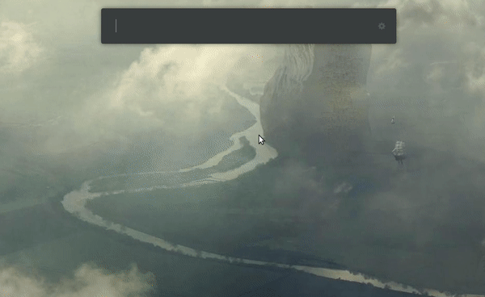

  

<h1 align="center">uRSSReader</h1>

Extension for [ULauncher](https://ulauncher.io/) - application launcher for Linux

### Browse up to five RSS channels

## Dependencies

This extension needs `feedparser` python module, install it with pip3

* `pip3 install feedparser --user`

## Instruction

1. In uRSSReader extension setting insert up to five RSS channels
2. Enjoy!